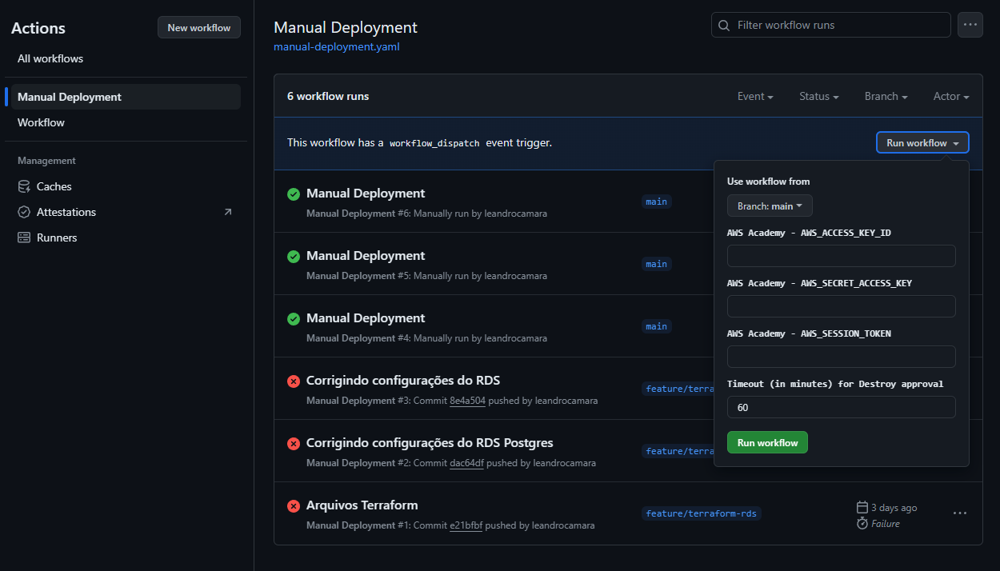
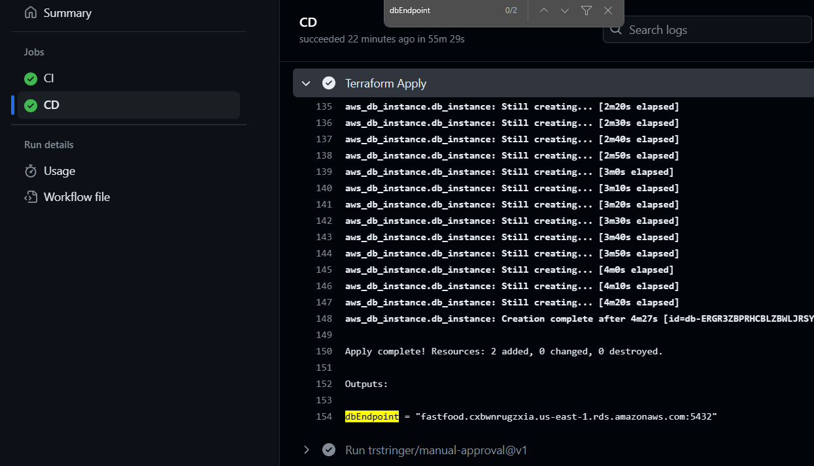
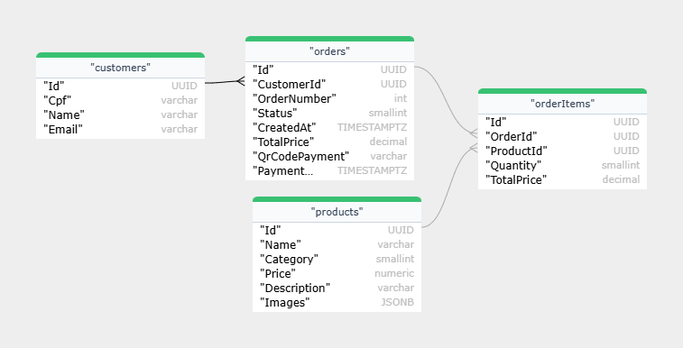

# fiap.tech-challenge.fast-food.infra.database

Este repositório é responsável por manter a infraestrutura do Banco de Dados da aplicação [**_Fast Food API_**](https://github.com/leandrocamara/fiap.tech-challenge.fast-food.api).

A infraestrutura é mantida com o [**_Terraform_**](https://www.terraform.io/) e provisionada na _AWS_.

## Execução

Após a execução dos [_Workflows_](https://github.com/leandrocamara/fiap.tech-challenge.fast-food.infra.database/actions) (GitHub Actions), um banco de dados [**_RDS_**](https://docs.aws.amazon.com/eks/) (_Relational Database Service_) é provisionado na _AWS_.

Há duas maneiras de executar e criar o banco de dados:

1. Realizando um `push` na `main`, por meio de um `Merge Pull Request`;

2. Executando o [_Manual Deployment_](https://github.com/leandrocamara/fiap.tech-challenge.fast-food.infra.database/actions/workflows/manual-deployment.yaml) (_Workflow_)

    

    2.1. Por padrão, o _Workflow_ utilizará as `Secrets` configuradas no projeto. Caso esteja utilizando o `AWS Academy`, recomenda-se informar as credencias da conta. **Obs.:** Cada sessão do _AWS Academy_ dura **4 horas**.

Independentemente do caminho escolhido, ao final do **_CD_** (após a execução do `$ terraform apply`), é criado uma [**_Issue_**](https://github.com/leandrocamara/fiap.tech-challenge.fast-food.infra.database/issues), que aguarda por uma aprovação, para **destruir** a infraestrutura criada. Esta etapa é útil para evitar gastos desnecessários na conta da _AWS (Academy)_.

  **Obs.:** Por padrão, o tempo aguardado é de **60 minutos**. Apenas os colaboradores do repositório possuem permissão para aprovação.

Ao final da execução do `$ terraform apply`, é impresso o **_Endpoint_** do _RDS_, que pode ser configurado na variável `DB_ENDPOINT` (sem a porta) da [**_Fast Food API_**](https://github.com/leandrocamara/fiap.tech-challenge.fast-food.api).

  

## Documentação

O banco escolhido foi o PostgreSQL que é um banco de dados relacional.

A escolha do banco se deu por algun fatores:
- Conhecimento do grupo de trabalho sobre o banco de dados;
- Licença *opensource*;
- Bom desempenho com grandes volumes de dados e com carga de requisições altas;
- Comunidade ativa, com lançamento de patchs e novas versões constantemente;
- Suporte a replicação;
- Aderente ao padrão SQL ANSI;
- Suporte a transações ACID (Atomicity, Consistency, Isolation and Durability)

Nosso banco de dados ainda possui poucas tabelas, mas todas elas com os devidos relacionamentos e definições de chave primária e chaves estrangeiras.

Diagrama ER do banco de dados PostgreSQL no status atual do projeto.

## Tech Challenge
Projeto para a curso de [Pós Graduação FIAP - Software Architecture](https://postech.fiap.com.br/curso/software-architecture/).

O grupo (19) é composto por:
- [Danilo Queiroz da Silva](https://github.com/DaniloQueirozSilva)
- [Elton Douglas Souza](https://github.com/eltonds88)
- [Leandro da Silva Câmara](https://github.com/leandrocamara)
- [Marcelo Patricio da Silva](https://github.com/mpatricio007)